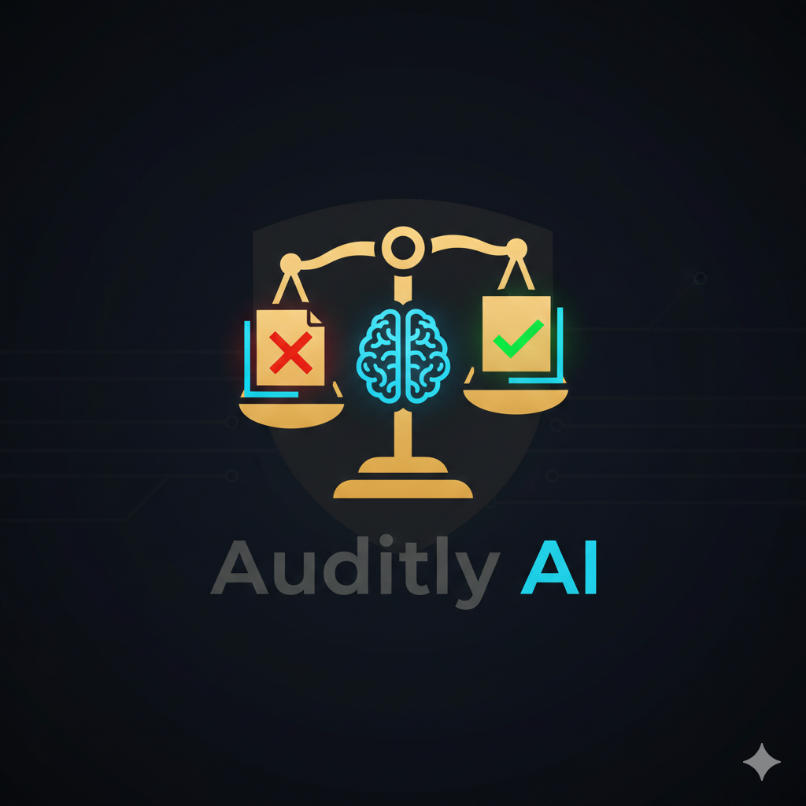

<div align="center">
  
  <h1>🚀 Auditly AI: Enterprise Intelligence</h1>
</div>
---

# ⚖️ Auditly AI — Smart Legal Document Auditor

<div align="center">


**AI-powered legal document auditing — from hours of manual review to seconds.**

*Identifies red flags, legal risks, and missing clauses in contracts automatically.*

[](https://auditly-ai-abdul.streamlit.app/)

</div>

---

## 📌 Table of Contents

- [Overview](#-overview)
- [Live Demo](#-live-demo)
- [Key Features](#-key-features)
- [Tech Stack](#-tech-stack)
- [How It Works](#-how-it-works)
- [Business Value](#-business-value)
- [Target Audience](#-target-audience)
- [Use Case Examples](#-use-case-examples)
- [Future Roadmap](#-future-roadmap)
- [Getting Started](#-getting-started)
- [Founder](#-founder--lead-developer)

---

## 🧠 Overview

Legal contract review is slow, expensive, and prone to human error. **Auditly AI** eliminates that bottleneck by leveraging **LLaMA 3.3** via Groq Cloud to automatically audit complex legal documents in seconds.

Upload a PDF contract and Auditly AI instantly identifies:

| | Finding |
|---|---|
| 🚩 | Critical Red Flags |
| ⚠️ | Potential Legal & Financial Risks |
| ❌ | Missing or Weak Clauses |
| 🤖 | AI-Generated / Manipulated Content |

---

## 🔗 Live Demo

> 🚀 **Try it now:** [https://auditly-ai-abdul.streamlit.app/](https://auditly-ai-abdul.streamlit.app/)

---

## ✨ Key Features

- 📂 **PDF Upload** — Drag and drop any legal contract for instant analysis
- 🤖 **LLM-Powered Auditing** — Deep contract analysis using LLaMA 3.3 via Groq Cloud
- 📄 **Auto-Generated Reports** — Clean, structured audit report in seconds
- 🔍 **Risk & Compliance Gap Detection** — Flags risky clauses and missing protections
- 🛡️ **AI Content Detection** — Identifies AI-generated or manipulated document text
- 📊 **Interactive Dashboard** — Clean Streamlit UI for a professional experience

---

## 🛠 Tech Stack

| Layer | Tools |
|---|---|
| **Frontend** | Streamlit |
| **AI & LLM** | LLaMA 3.3 via Groq Cloud |
| **AI Orchestration** | LangChain |
| **Backend Logic** | Python |
| **Document Processing** | PyPDF2 |

---

## ⚙️ How It Works

```
User Uploads PDF Contract
          │
          ▼
┌─────────────────────────┐
│    PyPDF2 Text Extract  │
│    Parse contract text  │
└─────────────────────────┘
          │
          ▼
┌─────────────────────────┐
│  LangChain + LLaMA 3.3  │
│  (via Groq Cloud)       │
│  Analyze for:           │
│  • Red flags            │
│  • Legal risks          │
│  • Missing clauses      │
│  • AI-generated content │
└─────────────────────────┘
          │
          ▼
┌─────────────────────────┐
│   Structured Audit      │
│   Report Generated      │
│   Displayed in          │
│   Streamlit Dashboard   │
└─────────────────────────┘
```

---

## 💼 Business Value

### ⏱️ Time Efficiency
- Reduces contract review from **hours → seconds** using LLaMA 3.3
- Instant red-flag detection without any manual reading

### 💰 Cost Reduction
- Minimizes reliance on expensive paralegal initial reviews
- Prevents costly legal mistakes by surfacing hidden liabilities early

### 🎯 Accuracy & Reliability
- AI provides **consistent audits** based on predefined legal parameters every time
- Integrated AI-text detection flags manipulated or synthetic document content

---

## 🎯 Target Audience

| Sector | Who Benefits |
|---|---|
| ⚖️ **Legal** | Lawyers & paralegals auditing bulk contracts |
| 🏢 **Corporate** | HR managers reviewing employment contracts |
| 🛒 **Procurement** | Teams reviewing vendor agreements |
| 🏡 **Real Estate** | Agents scanning property & sale deed agreements |
| 🏦 **Finance** | Mortgage officers verifying document authenticity |
| 🛡️ **Compliance** | Internal auditors performing digital document audits |

---

## 📚 Use Case Examples

- **Contract Review** — Full clause-by-clause risk analysis
- **Legal Compliance Checks** — Verify contracts meet regulatory standards
- **Risk Assessment** — Score and rank contract risk levels
- **Due Diligence Automation** — Rapidly screen documents before deeper review

---

## 🛣️ Future Roadmap

### 📱 Phase 1 — Mobile Accessibility
- Android & iOS cross-platform app for real-time document scanning
- Cloud sync for audit history across devices

### 🤖 Phase 2 — Advanced AI Capabilities
- Multi-language support for regional legal documents
- OCR integration for handwritten and scanned physical documents

### 🛡️ Phase 3 — Blockchain & Security
- Blockchain-based immutable audit records
- Enhanced deepfake text detection engine

---

## 🚀 Getting Started

### 1. Clone the Repository

```bash
git clone https://github.com/Musawir456/auditly-ai.git
cd auditly-ai
```

### 2. Install Dependencies

```bash
pip install -r requirements.txt
```

### 3. Set Up Environment Variables

Create a `.env` file and add your Groq API key:

```
GROQ_API_KEY=your_groq_api_key_here
```

### 4. Run the App

```bash
streamlit run app.py
```

### 5. Open in Browser

```
http://localhost:8501
```

---

## 👨‍💻 Founder & Lead Developer

<div align="center">

**Abdul Musawir**
*Founder & CEO — Auditly AI*
*AI/ML Engineer & Data Scientist
🎓 BS Internet of Things (IoT) — Superior University, Lahore
🎯 Focus: AI Business Automation · Legal Tech · Scalable Tech Startups

*"Leveraging AI and IoT to automate complex manual processes, helping organizations save time and reduce operational risks."*

[](https://www.linkedin.com/in/abdul-musawir-a9713a20b/)
[](https://github.com/Musawir456)
[](https://www.kaggle.com/abmusawir)
[](https://auditly-ai-abdul.streamlit.app/)

</div>

---

## 📜 License

This project is licensed under the **MIT License** — you are free to use, modify, and distribute this software for personal or business purposes, provided that credit is given to the original creator.

Contributions from developers and legal experts are welcome to make document auditing more accessible for everyone. 🤝

---

<div align="center">

⭐ **If Auditly AI helped you, please give it a star!** ⭐

*Built with ❤️ by Abdul Musawir — Superior University, Lahore*

</div>

